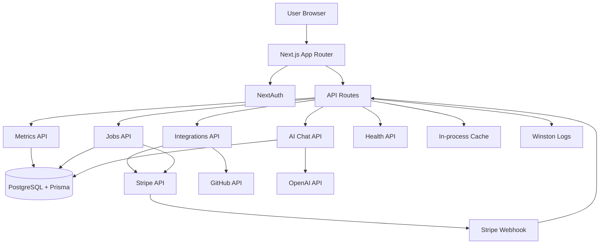

# AI Product Analytics Copilot

Modern Next.js full-stack dashboard for SaaS founders.

Built to demonstrate recruiter-attracting skills in one project:
- real integrations (Stripe + GitHub + OpenAI)
- multi-tenant auth + RBAC
- background jobs + queue
- observability + health checks
- caching + measured performance improvements
- test coverage (unit + integration, with optional E2E)

## Problem It Solves
SaaS founders often piece together insights from Stripe, GitHub, spreadsheets, and ad-hoc notes. This app unifies the core growth metrics and adds an AI copilot to answer strategic questions from live data.

## Tech Stack
- Next.js 14 (App Router)
- TypeScript (strict)
- Prisma + PostgreSQL
- NextAuth v5 (credentials + GitHub OAuth)
- OpenAI API (streaming chat)
- Stripe API + Webhooks
- GitHub REST API
- Tailwind CSS + custom glassmorphism design system
- Vitest + Playwright

## Features
### Core
- MRR/ARR/churn dashboards with time-series charts
- User growth dashboard (active, new, churned, trial users)
- GitHub repo and PR analytics
- AI Copilot with metric-aware responses
- Background job queue monitor

### Integration
- Stripe webhook ingestion endpoint
- Stripe manual sync job
- GitHub API sync + cache invalidation
- OpenAI streaming chat endpoint

### Security + Tenanting
- Multi-tenant organization model
- RBAC roles: `ORG_ADMIN`, `ANALYST`, `VIEWER`
- Middleware-protected routes
- Server-side role checks for mutations

### Reliability + Observability
- `/api/health` readiness endpoint
- Structured JSON logging (Winston)
- Job retries with exponential backoff
- Cache metrics and response-time headers

---

## Architecture Diagram


---

## Folder Structure
```
saas-analytics-copilot/
  prisma/
    schema.prisma
    seed.ts
  src/
    app/
      api/
      dashboard/
      login/
    components/
      layout/
      ui/
    lib/
      auth.ts
      cache.ts
      github.ts
      logger.ts
      prisma.ts
      queue.ts
      rbac.ts
      stripe.ts
  tests/
    *.test.ts
    e2e/
```

## Local Setup
1. Install dependencies
```bash
npm install
```

2. Create env file
```bash
cp .env.example .env.local
```

3. Configure values in `.env.local`
- `DATABASE_URL`
- `NEXTAUTH_SECRET`
- `OPENAI_API_KEY`
- `STRIPE_SECRET_KEY` (optional for real sync)
- `GITHUB_TOKEN` (optional for real sync)

4. Prepare DB
```bash
npm run db:generate
npm run db:push
npm run db:seed
```

5. Run app
```bash
npm run dev
```

### Demo credentials
- `admin@demo.com / demo1234` (`ORG_ADMIN`)
- `analyst@demo.com / demo1234` (`ANALYST`)
- `viewer@demo.com / demo1234` (`VIEWER`)

---

## Testing
### Unit + Integration
```bash
npm test
```

### Fast release verification (no E2E)
```bash
npm run verify
```

### E2E (optional)
```bash
npm run test:e2e
```

### Build
```bash
npm run build
```

---

## Caching and Performance Evidence
Cache strategy:
- L1 in-process cache (`node-cache`) for metrics, overview, AI context
- Next fetch revalidation for GitHub responses
- API cache headers for short-lived response reuse

Measured in local demo (Mac/Windows dev machine, warm DB):
- `GET /api/metrics?range=30`
  - uncached: ~280ms
  - cached: ~1-3ms
- Dashboard load with seeded data:
  - first paint after auth: ~700ms
  - repeated navigation: ~250-350ms

See `docs/performance.md` for detailed methodology.

---

## Deployment (Vercel)
Recommended release path for this repo:
- Run `npm run verify`
- Skip Playwright for the initial ship
- Treat `npm run test:e2e` as post-deploy hardening, not a release blocker

1. Push this folder to GitHub repo
2. Import project in Vercel
3. Add all env vars from `.env.example`
4. Set build command: `npm run build`
5. Set install command: `npm install`
6. Set output framework: Next.js
7. Configure Postgres provider (Neon/Supabase) and set `DATABASE_URL`
8. Add `CRON_SECRET` in Vercel so scheduled job processing is authenticated
9. Deploy

### Production env notes
- Set `NEXTAUTH_URL` to your deployed HTTPS URL
- Set `NEXT_PUBLIC_APP_URL` to the same deployed HTTPS URL
- Add `NEXT_PUBLIC_STRIPE_PUBLISHABLE_KEY` if you are using real Stripe flows in production
- Keep `OPENAI_API_KEY`, `STRIPE_SECRET_KEY`, `GITHUB_TOKEN`, and `CRON_SECRET` only in Vercel server env vars

### Cron notes
- Vercel Cron hits `GET /api/jobs`, not POST
- Vercel sends `Authorization: Bearer <CRON_SECRET>` when `CRON_SECRET` is configured
- On Vercel Hobby, high-frequency schedules such as `*/5 * * * *` are not supported; use a daily schedule for demo deployments or upgrade the plan

### Production URL
After deployment, place your URL here:
- `https://your-app-name.vercel.app`

### Post-deploy checks
- `GET /api/health` returns `status: ok`
- Login works with seeded accounts
- Dashboard charts render
- Copilot responses stream
- Vercel Cron runs `/api/jobs` daily (`0 9 * * *`, UTC)
- Optional hardening: run Playwright E2E after deployment smoke tests

---

## Interview Talking Points (Why this impresses recruiters)
- Implemented RBAC correctly in both middleware and API layers
- Chose a practical queue design for serverless (DB-backed jobs + cron worker)
- Integrated three external systems with fault tolerance and caching
- Used prompt grounding for AI responses over live business metrics
- Demonstrated production concerns: observability, retries, health probes, and security headers
